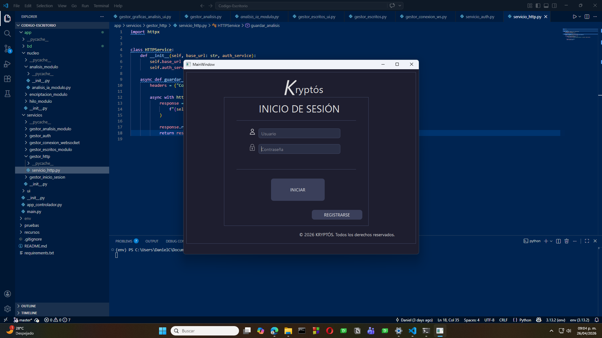
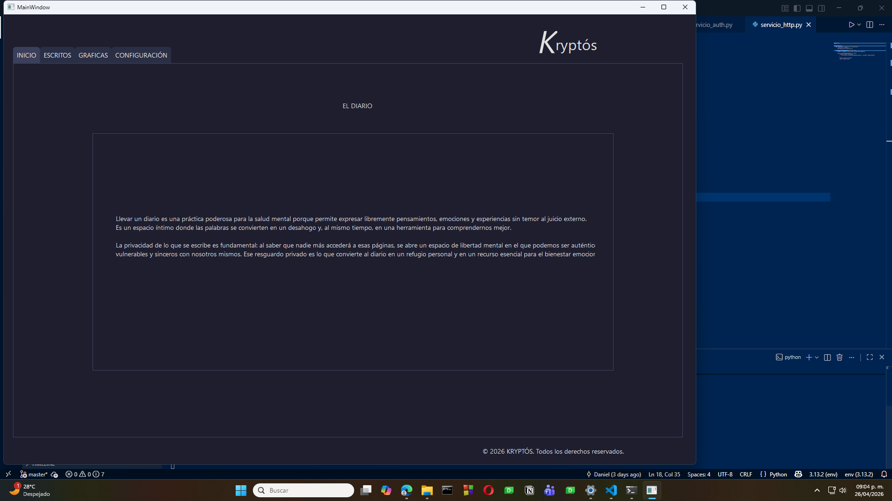
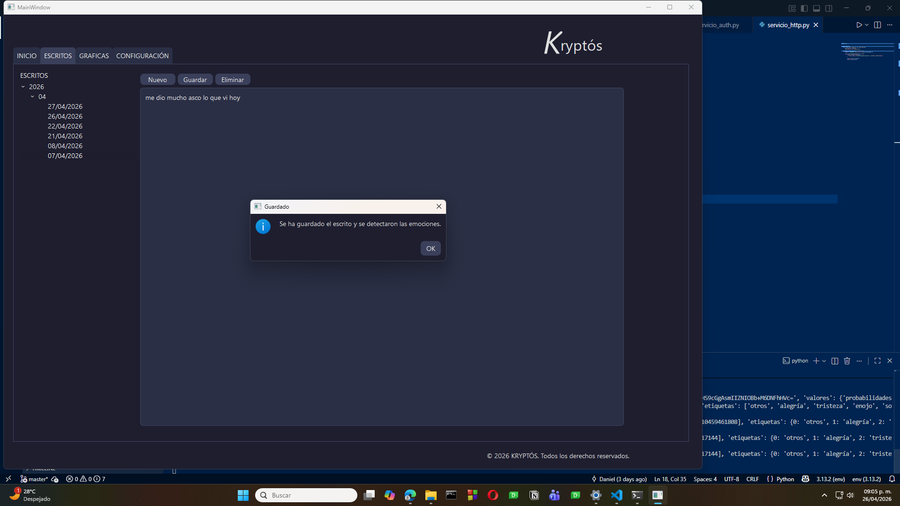
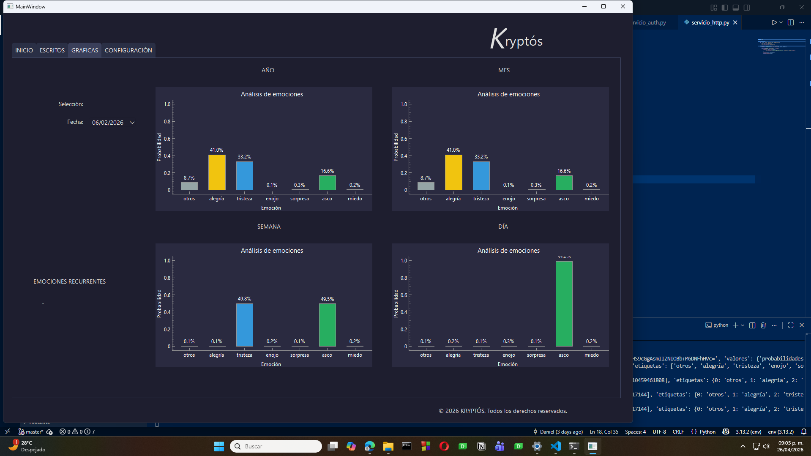
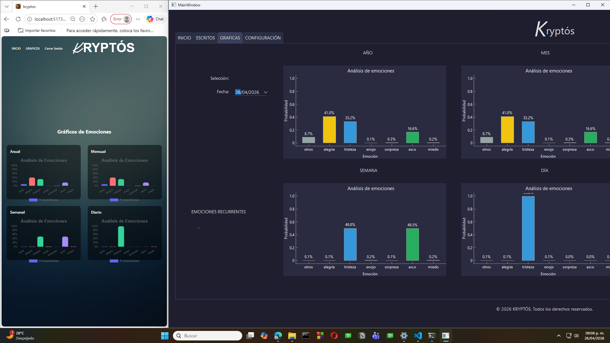

# 🔒 KRYPTOS Desktop

Aplicación de escritorio desarrollada en **Python** para la gestión segura de un diario personal con almacenamiento cifrado, análisis emocional mediante Inteligencia Artificial y sincronización con una plataforma web.

---

# 📖 Descripción

KRYPTOS es una aplicación enfocada en la privacidad del usuario. Permite almacenar escritos personales de forma completamente local utilizando técnicas criptográficas avanzadas.

Cada escrito es analizado automáticamente mediante un modelo de Inteligencia Artificial basado en **BETO (BERT para español)**, permitiendo generar estadísticas emocionales que posteriormente pueden visualizarse de manera local y en una plataforma web.

---

# ✨ Características

- 📝 Gestión de escritos
- 🔒 Almacenamiento local cifrado
- 🔑 Protección mediante AES-GCM
- 🔐 Derivación segura de claves con PBKDF2
- 🤖 Análisis emocional con IA
- 📊 Estadísticas emocionales
- ⚡ Comunicación con FastAPI
- 📈 Sincronización en tiempo real

---

# 🛠️ Tecnologías

- Python
- PySide6
- SQLite
- PyCryptodome
- BETO (BERT Español)

---

# 📸 Capturas

## Inicio de sesión



---

## Pantalla principal



---

## Editor de texto 



---

## Estadísticas



---

## Página web


---

## Ámbos



---

# 🚀 Instalación

```bash
git clone https://github.com/DanielC027/modular-escritorio.git

cd modular-escritorio

pip install -r requirements.txt

python -m app.main
```

---

# 🔐 Seguridad

El sistema implementa diversas técnicas enfocadas en la protección de la información del usuario.

- AES-GCM
- PBKDF2
- JWT
- Almacenamiento local
- Sin dependencia de servicios en la nube

---

# 🤖 Inteligencia Artificial

El análisis emocional es realizado mediante el modelo **BETO**, una adaptación de BERT entrenada para el idioma español.

---

# 📚 Proyecto relacionado

El proyecto completo está dividido en tres repositorios.

- 🖥️ modular-escritorio
- ⚙️ modular-backend
- 🌐 modular-pagina-web

---

# 👨‍💻 Autor

**Daniel Canela**

Universidad de Guadalajara